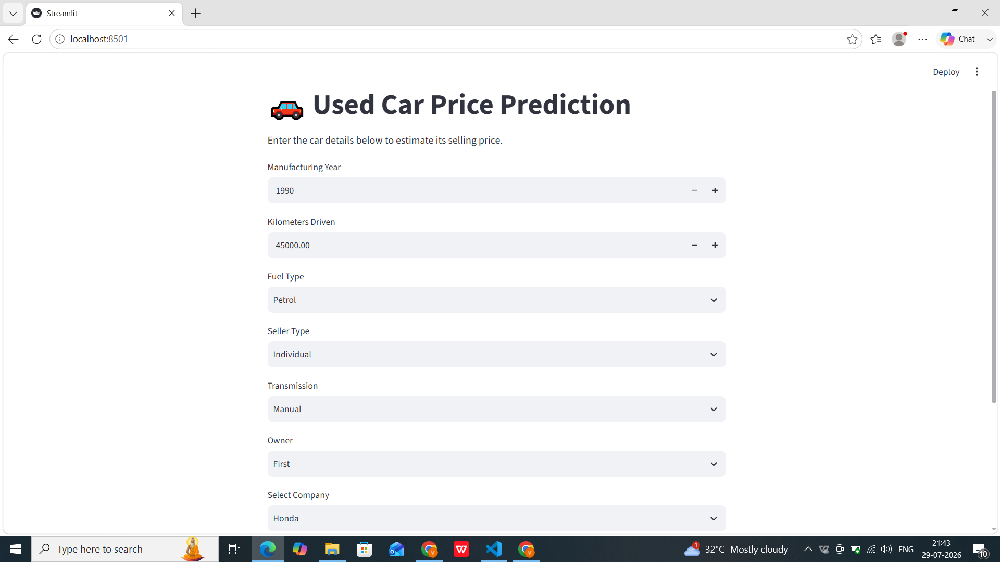
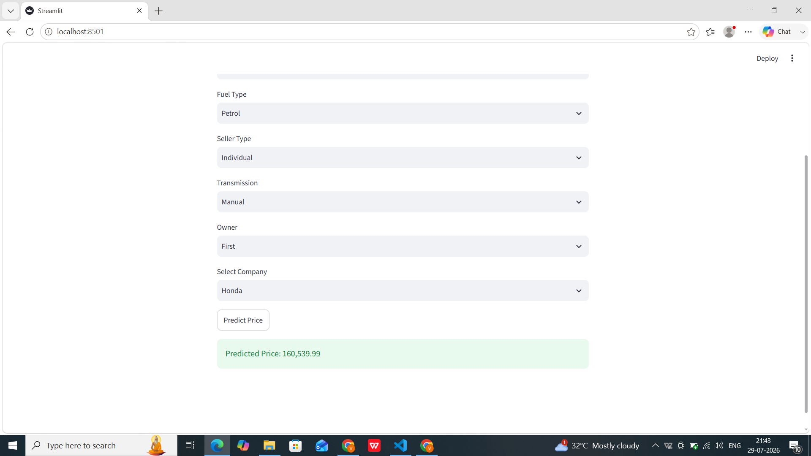

# 🚗 Used Car Price Prediction

A Machine Learning web application that predicts the estimated selling price of a used car based on its features.


## 📌 Project Overview

This project uses Machine Learning to estimate the selling price of a used car using details such as:

- Company
- Manufacturing Year
- Kilometers Driven
- Fuel Type
- Seller Type
- Transmission
- Owner Type

The application is built with **Streamlit**, allowing users to enter car details through a simple web interface and receive an instant price prediction.

---

## ✨ Features

- Predict used car prices instantly
- Interactive Streamlit web application
- Data preprocessing using Scikit-learn Pipeline
- One-Hot Encoding for categorical features
- Feature Engineering by extracting car company from the car name
- Random Forest Regression model
- Clean and beginner-friendly implementation

---

## 🛠️ Tech Stack

- Python
- Pandas
- NumPy
- Scikit-learn
- Streamlit
- Pickle

---

## 📊 Machine Learning Workflow

1. Data Loading
2. Data Cleaning
3. Exploratory Data Analysis (EDA)
4. Feature Engineering
5. Train-Test Split
6. One-Hot Encoding using ColumnTransformer
7. Model Training
8. Model Evaluation
9. Model Serialization using Pickle
10. Streamlit Deployment

---

## 🤖 Models Tested

| Model | R² Score |
|--------|----------|
| Linear Regression | 0.57 |
| Decision Tree Regressor | 0.65 |
| Random Forest Regressor | **0.70** |

Random Forest Regressor provided the best performance and was selected for deployment.

---

## 📁 Project Structure

```
Used-Car-Price-Prediction/
│
├── app.py
├── car_price_model.pkl
├── car_data.csv
├── requirements.txt
├── README.md
└── images/
```

---

## 🚀 Installation

Clone the repository

```bash
git clone https://github.com/vanshikagoyal2006712-byte
```

Move into the project directory

```bash
cd Used-Car-Price-Prediction
```

Install the required libraries

```bash
pip install -r requirements.txt
```

Run the Streamlit application

```bash
streamlit run app.py
```

---

## 📷 Screenshots

### Home Page



### Prediction Result



---

## 🔮 Future Improvements

- Hyperparameter tuning
- More advanced feature engineering
- Support for additional car features
- Improved prediction accuracy
- Cloud deployment
- Better user interface

---

## 👩‍💻 Author

**Vanshika Goyal**

B.Tech Computer Science Engineering Student

Passionate about Machine Learning, Python and building real-world projects.

---

## ⭐ If you found this project useful, consider giving it a star!